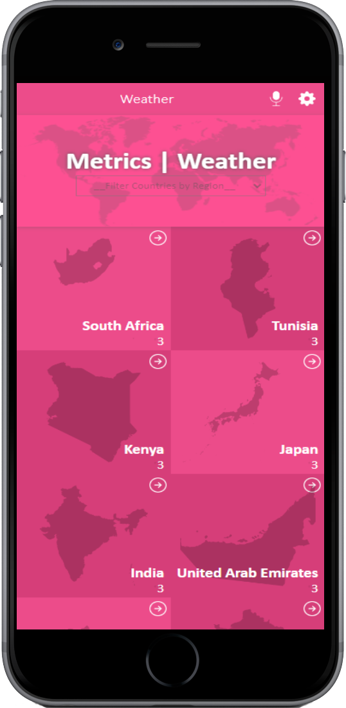

# Metrics - Weather
This application has 3 pages, a `Home` with a list of countries that can be filtered by region, a `Cities` page with a list of cities for the selected country, and finally a `Details` page with the weather details. The app gets the data from the [OpenWeather](https://openweathermap.org/api).

<p align="center"></p>

## Built With

- HTML
- CSS
- JavaScript
- React
- Redux

## Live
[Preview](https://venerable-cranachan-299537.netlify.app/)

## Install

To get a local copy up and running follow these simple example steps.
- Copy this link
  ```
  https://github.com/jasonfelice/Air-Pollution
- Open the terminal
- Run "git clone" and paste the link
- Install dependencies using `npm install` and start live server `npm start`
- Open this folder in your code editor
- Create a feature branch to work on
- Now you can edit and make a pull request

## Authors

👤 **Jake Felice**

<p align="left">
<a href = "https://www.linkedin.com/in/jason-felice-11a5a622b/"></a>
<a href = "https://twitter.com/jasonfelice0"></a>
<a href = "https://github.com/jasonfelice"></a>
</p>

# Attributions

- Original design idea by [Nelson Sakwa on Behance](https://www.behance.net/sakwadesignstudio).
- Mic icons created by [srip - Flaticon](https://www.flaticon.com/free-icons/mic).
- Previous icons created by [Retinaicons - Flaticon](https://www.flaticon.com/free-icons/previous).
- Favicon icons created by [iconixar - Flaticon](https://www.flaticon.com/free-icons/rain).
- Next icons created by th [studio - Flaticon](https://www.flaticon.com/free-icons/next).
- [World map](https://www.pngall.com/world-map-png/download/25355).
- All the [country maps](https://vemaps.com/).


## 🤝 Contributing

Contributions, issues, and feature requests are welcome!

Feel free to check the [issues page](../../issues/).
